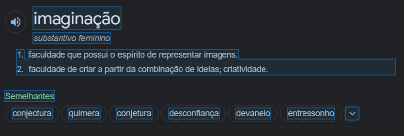

Sou uma agência de *um* homem só, iniciante no mercado mas macaco velho nas experiências da web, possuindo meu primeiro trabalho avassalador de uma implementação de website na época onde se revolucionou no mercado o uso de computação gráfica para interatividade na tela, de volta em 2013 um website artístico e apresentativo para um projeto ganhador de licitação de um filme, 

A Doce Flauta da Liberdade, em Vitória da Conquista, quando ainda cursava ensino médio, já estudando engenharia de design web há mais de 2 anos.

Comecei a aprender minúncias de animação e computação gráfica e programação aplicada ainda adolescente, entusiasmado em modificações de jogos famosos da época que suportavam comunidades de modificadores mundo a fora. Meu maior passa-tempo depois da aula era o forum dos teamkings, time de gamers programadores da época.

Na metade de 2017 apresentei uma ideia que estava estudando para um amigo, corretor de imóveis que trabalhava com meu pai na época. Ele achou brilhante os corretores de imóveis não precisarem mais sofrer com corridas do campo ao escritório e virce versa para fechar uma venda no local certo, além de sofrer com representações imprecisas e inconstantes de mapas dos loteamentos.

O auge desta ideia foi no final de 2018 na cidade de amargosa, onde eu fui elogiado por todos da equipe e dos clientes que passavam pelo escritório pela iniciativa do aplicativo de vendas e a inovação.

*Hoje*, após sofrer muito com o mundo da web (frameworks, ferramentas, etc), pois tive que aprender muito para amadurecer todos os complexos aspectos que um negócio de tecnologias, leva, conheci a camada final do meu negócio: *narrativas e pessoas*.  

Aprendi que mergulhei muito no caminho da engenharia, e a chave para desenrolar estava na vertente que sempre levei jeito, mas inexplorado:  
A imaginação e a narração.

Elementos que a primeira vista parecem apenas tem uma relação muito indereta, mas que na verdade, uma é construção sobre a outra. 

#### Narração:
>  Segundo o dicionário de Oxford, narração é:
  

é interessante perceber que entre as palavras *semelhantes* está: apresentação, exposição, declaração e descrição.

Para mim, parece incompleto, afinal, o quê seria- melhor, do quê seria essa ... *"apresentação"* e *"exposição"*?

A resposta é:   
### 
 Da **abstração** 

  
Para soar menos dramático e mais prático,  
Narração se apresenta como a forma verbal, ***e funcional*** de algo, para possuir essa forma, só é possível ser abstrata.

No abstrato, lidamos com a mente, pois nela que tudo isso vive e nela que tudo isso afeta.

Portanto, a imaginação, **que sabemos bem que simplesmente é a ação de se inventar algo a nível abstrato**:
>>  

# ***Possuir então,***
***A*** ***capacidade***  de **analisar**, **criar** e **implementar** o principal elemento de ***vendas***, em um ambiente de efeito puramente mental, é como o paraíso para minhas habilidades de infância onde são focadas no mercado e no que é necessário para manter o pé firme nele.

Com o amadurecimento e o interesse na psicologia humna, veio a sabedoria para ver com clareza e fluidez as necessidades e intenções dos meus clientes e os clientes deles, criando em mim a fôrma ideal de alguém que vai fazer o ***port*** de sua marca para seus clientes, no meio virtual. Atendendo todos os requisitos para o seu marketing, e todas as funcionalidades atraentes e engajantes. Ambas, como todo o embasamento teórico para construir o melhor valor para sua empresa.

Agora,

#### Peça uma proposta por email (icaroglauco@email.com) ou acesse a proposta padrão de serviço