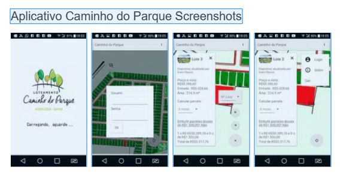

### Sou uma agência de *um* homem só,
 iniciante no mercado mas macaco velho nas experiências da web, possuindo meu primeiro trabalho avassalador de uma implementação de website na época onde se revolucionou no mercado o uso de computação gráfica para interatividade na tela, de volta em 2013 um website artístico e apresentativo para um projeto ganhador de licitação de um filme, 

A Doce Flauta da Liberdade, em Vitória da Conquista, quando ainda cursava ensino médio, já estudando engenharia de design web há mais de 2 anos.

Comecei a aprender minúncias de animação e computação gráfica e programação aplicada ainda adolescente, entusiasmado em modificações de jogos famosos da época que suportavam comunidades de modificadores mundo a fora. Meu maior passa-tempo depois da aula era o forum dos teamkings, time de gamers programadores da época.

Na metade de 2017 apresentei uma ideia que estava estudando para um amigo, corretor de imóveis que trabalhava com meu pai na época. Ele achou brilhante os corretores de imóveis não precisarem mais sofrer com corridas do campo ao escritório e virce versa para fechar uma venda no local certo, além de sofrer com representações imprecisas e inconstantes de mapas dos loteamentos.

O auge desta ideia foi no final de 2018 na cidade de amargosa, onde eu fui elogiado por todos da equipe e dos clientes que passavam pelo escritório pela iniciativa do aplicativo de vendas e a inovação.

*Hoje*, após sofrer muito com o mundo da web (frameworks, ferramentas, etc), pois tive que aprender muito para amadurecer todos os complexos aspectos que um negócio de tecnologias, leva, conheci a camada final do meu negócio: *narrativas e pessoas*.  

Aprendi que mergulhei muito no caminho da engenharia, e a chave para desenrolar estava na vertente que sempre levei jeito, mas inexplorado:  
A imaginação e a narração.

Elementos que a primeira vista parecem apenas tem uma relação muito indereta, mas que na verdade, uma é construção sobre a outra. 

#### Narração:
>  Segundo o dicionário de Oxford, narração é:
  

é interessante perceber que entre as palavras *semelhantes* está: apresentação, exposição, declaração e descrição.

Para mim, parece incompleto, afinal, o quê seria- melhor, do quê seria essa ... *"apresentação"* e *"exposição"*?

A resposta é:   
### 
 Da **abstração** 

  
Para soar menos dramático e mais prático,  
Narração se apresenta como a forma verbal, ***e funcional*** de algo, para possuir essa forma, só é possível ser abstrata.

No abstrato, lidamos com a mente, pois nela que tudo isso vive e nela que tudo isso afeta.

Portanto, a imaginação, **que sabemos bem que simplesmente é a ação de se inventar algo a nível abstrato**:
>>  

# ***Possuir então,***
***A*** ***capacidade***  de **analisar**, **criar** e **implementar** o principal elemento de ***vendas***, em um ambiente de efeito puramente mental, é como o paraíso para minhas habilidades de infância onde são focadas no mercado e no que é necessário para manter o pé firme nele.

Com o amadurecimento e o interesse na psicologia humna, veio a sabedoria para ver com clareza e fluidez as necessidades e intenções dos meus clientes e os clientes deles, criando em mim a fôrma ideal de alguém que vai fazer o ***port*** de sua marca para seus clientes, no meio virtual. Atendendo todos os requisitos para o seu marketing, e todas as funcionalidades atraentes e engajantes. Ambas, como todo o embasamento teórico para construir o melhor valor para sua empresa.

Agora,

## What can I do for you?

### Aqui uma lista do que eu posso fazer com minhas habilidades
- Arquitetura compreensível de cores e posicionamentos
- Animações usando qualquer tecnologia baseada em frames e curvas de efeito
- Funcionalidades asyncronas no front end com apis e saas's, com consciência na experiência de usuário
- Interações a base de eventos e usuário, com todo o resto dos componentes que trabalho: narrativo, funcional

### O quê eu não posso fazer
- Escolher a visão do negócio do cliente a fim de destilar seu conteúdo: apensar de eu conseguir usar conteúdos e criar uma narrativa na web com todas as tecnologias abstratas e diretas na web, não sou capaz de escolher a perspectiva melhor para o cliente.
- Desenvolver ponta a ponta: não sou capaz de criar um produto com profundidade no servidor ao mesmo tempo que no cliente. Uma vez que sou capaz de aprofundar individualmente em cada, os dois ao mesmo tempo é impossível, se o cliente insistir, posso realizar um trabalho primeiro no servidor, seguido de começar o trabalho no cliente, resultando em contratação de dois profissionais.

## Como parece uma proposta padrão do eu posso fazer como serviço

### Proposta de venda, com  
- Serviço de website  
- com integração a celular
- Narrativa de página para conversão em vendas 
- Aplicativo exclusivo customizado de comunicação em tempo real para loteamentos (cliente e vendedores)
- Preço promocional de *quase* **zero**

***Logo abaixo***, estão os detalhes de como está estruturado meu serviço, detalhando o que é e como impacta sua marca, e logo após, falo de como 

## Serviço de website

<h3>Múltiplas páginas de tecnologia instantânea de renderização</h3>
<small class="descrição-rápida">páginas lentas ou mal renderizadas geram instatânea desaprovação, consequentemente, qualquer outra coisa que fizermos</small>
Utilizo ponta de linha em termos de tecnologias para produção e renderização de páginas web, possibilitando hospedagens gratuitas pagando apenas domínio  

<h3>Páginas com propósito unificado de venda e marketing</h3>
<small class="descrição-rápida">A inteção da página deve ser direta e eficaz</small>
TODO 

  
  
<h3>Sessões das páginas com design inovador  </h3>
<small class="descrição-rápida">descrição rápida</small>
Entre chats online, Mapas em tempo real, simulações financeiras e galerias dinâmicas, e até mesmo conteúdos de texto. As sessões são os componentes de escopo mais focado e é possível escolher a abordagem e tecnologia para seu papel. As habilidades com psicologia do design para texto e imagem e capacidades

<h2>Integração a celular</h2>
<small class="descrição-rápida">descrição rápida</small>
Possuo habilidade de integrar uma página web como um aplicativo de celular. Atravéns de dois níveis de integração, ambos posso utilizar recursos próprios do celular como câmeras, localizações, armazenamento e logins automáticos. Todas essas, capacidades queridas em aplicativos de celular mas sem a necessária instalação do software em si no celular.

*obs: O último nível de integração se utiliza da instalaçãõ de um aplicativo simples para acesso direto ao produto web, se tornando mais perto de uma aplicação instalada possibilitando acesso offline*

<h2>Narrativa de páginas para conversão em vendas </h2>
<small class="descrição-rápida">Suas páginas vendem pela experiência narrativa fundida a oportunidade de ação para o cliente </small>

As páginas seguem uma narrativa: utilizamos elementos e sessões para criar uma experiência personalizada ao empreendimento e customizada ao público-alvo. Por essa perspectiva, é possível atingir qualquer interesse de mercado onde a narrativa que o visitante experiencia é o fator determinante na sua escolha de ação com a empresa em questão.  

  
Conversão em vendas se acontece pelo acreditar do cliente em seu serviço, tornando a ponte da comunicação de crucial importância. Quando lidamos com um cliente, estamos em tarefa constante de ser o que ele precisa e assim, evoluimos.

Conversão em páginas é o termo utilizado para representar o momento que o cliente decide por vez de comprar o que está vendo, motivado pela necessidade contida nele.   

Acontece de ser o maior inimigo da venda: o próprio vendedor. Quando ali, não conecta a necessidade do cliente a realidade do serviço da empresa (contando aqui: preços, flexibilidades, serviços).  

E Por isso

<h2>Aplicativo exclusivo customizado de comunicação emtempo real para loteamentos (cliente e vendedores)</h2>
<small class="descrição-rápida">descrição rápida</small>

<h2>

Preço promocional de *quase* **zero** </h2>

<small class="descrição-rápida">descrição rápida</small>

